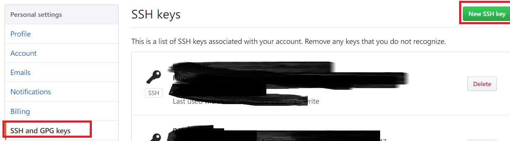
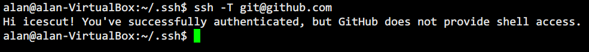

# 配置电脑以使用github

## 前提
1. 拥有github帐号
2. 电脑上安装了git

## 步骤
1. 输入命令`ssh-keygen -C 'you email address@gmail.com' -t rsa`。
    将在`home`目录的`.ssh`目录下生成公钥和密钥。
    ```
    .ssh
     |
     |--id_rsa          这是密钥
     |--id_rsa.pub      这是公钥
    ```
2. 在github的setting中找到SSH and GPG keys选项，点击New SSH key，起个title，将`id_rsa.pub`的内容粘贴上去。
    
3. 测试连接，输入命令`ssh -T git@github.com`。
    

完成！