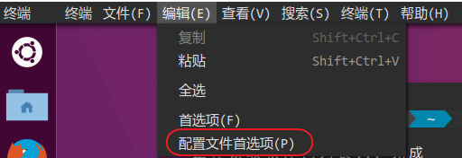
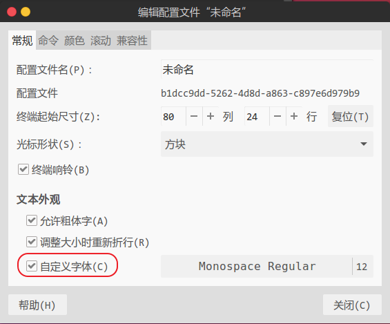
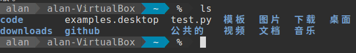

# powerline

## powerline-shell
powerline-shell美化你的命令提示符。  

项目地址：[b-ryan/powerline-shell](https://github.com/b-ryan/powerline-shell)

安装：  
1. `pip install powerline-shell`
2. 配置你的bash或zsh，以zsh为例。
    ```zsh
    function powerline_precmd() {
        PS1="$(powerline-shell --shell zsh $?)"
    }

    function install_powerline_precmd() {
    for s in "${precmd_functions[@]}"; do
        if [ "$s" = "powerline_precmd" ]; then
        return
        fi
    done
    precmd_functions+=(powerline_precmd)
    }

    if [ "$TERM" != "linux" ]; then
        install_powerline_precmd
    fi
    ```
3. 解决乱码。  
    打开配置文件首选项：  
    
    勾选自定义字体：  
    

结果：  
