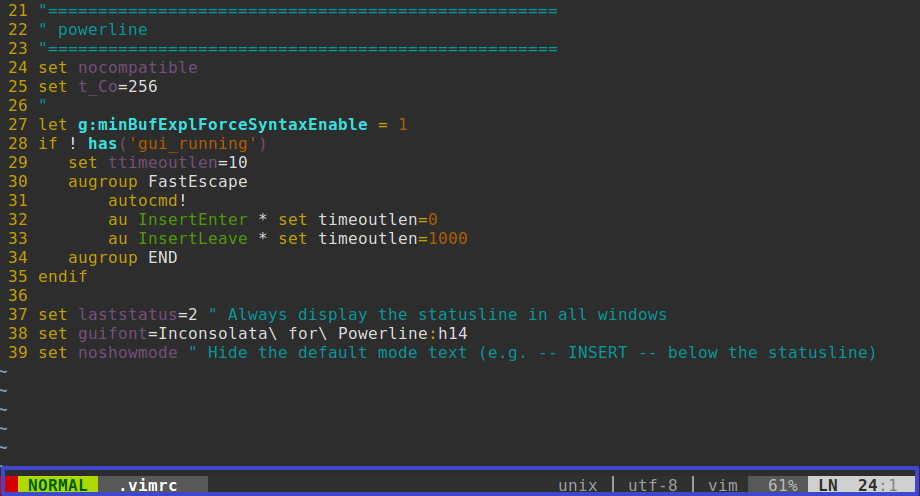

# Vim powerline

## 安装
1. 使用Vundle安装。
    ```
    Plugin 'https://github.com/Lokaltog/vim-powerline.git'
    ```
2. 配置`.vimrc`。
    ```
    set nocompatible
    set t_Co=256
    
    let g:minBufExplForceSyntaxEnable = 1
    
    if ! has('gui_running')
        set ttimeoutlen=10
        augroup FastEscape
            autocmd!
            au InsertEnter * set timeoutlen=0
            au InsertLeave * set timeoutlen=1000
        augroup END
    endif
    
    set laststatus=2 " Always display the statusline in all windows
    set guifont=Inconsolata\ for\ Powerline:h14
    set noshowmode " Hide the default mode text (e.g. -- INSERT -- below the statusline)
    EOF
    ```

结果：
