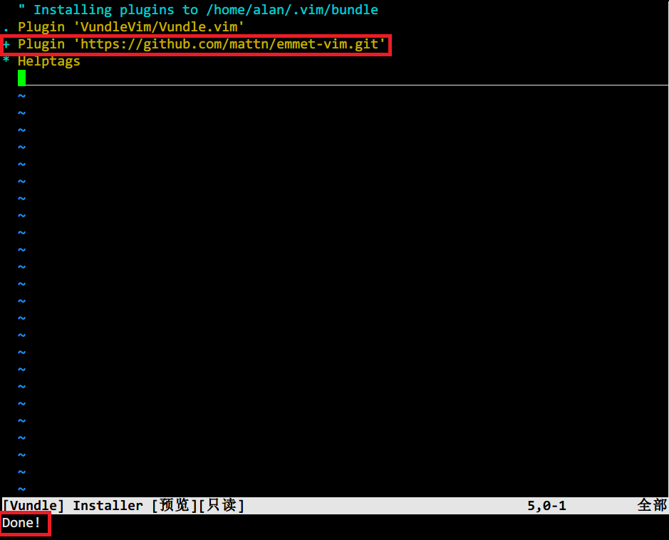

# Vundle

## 安装Vundle
使用`git clone https://github.com/VundleVim/Vundle.vim.git ~/.vim/bundle/Vundle.vim`即可在机器上安装Vundle。

## 配置
在`.vimrc`开始处添加如下内容。
```python
set nocompatible              " be iMproved, required
filetype off                  " required

" set the runtime path to include Vundle and initialize
set rtp+=~/.vim/bundle/Vundle.vim
call vundle#begin()

" let Vundle manage Vundle, required
Plugin 'VundleVim/Vundle.vim'
" 最好使用github地址
Plugin 'https://github.com/mattn/emmet-vim.git'
call vundle#end()            " required
filetype plugin indent on    " required
```

## 管理插件
1. 打开vim之后输入`:PluginInstall`即可安装`.vimrc`中定义中的插件。

安装完成后在插件名字前面有个加号，当全部完成后，左下角有`Done!`字样。
2. `:PluginList`，列出已安装的插件。
3. `:PluginSearch`查找插件，但资源似乎比较少。
3. `:PluginClean`清理没用的插件。


